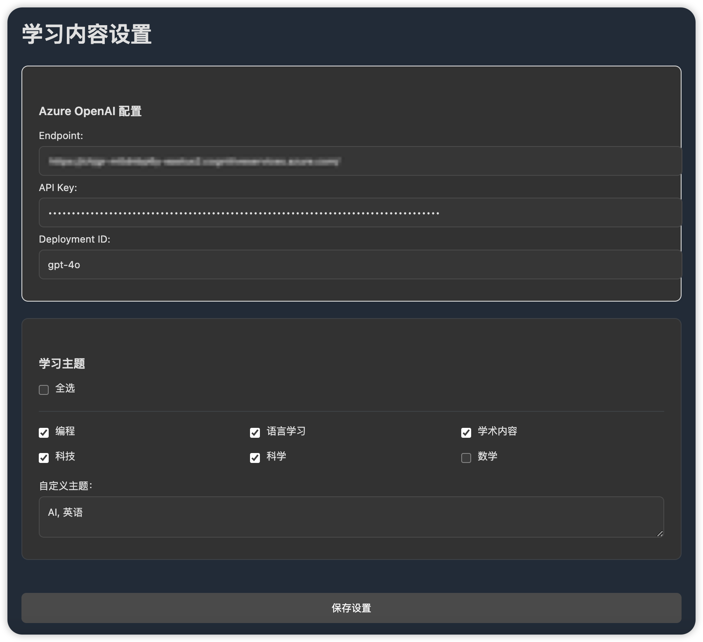

# 学习时刻

[English Documentation](README.md)

一个帮助你专注学习的 Chrome 扩展，通过智能识别和过滤 B站 视频内容，让你的学习更加高效。

## 功能特点

- 🎯 智能识别学习相关内容
- 🔍 自动过滤非学习内容
- 🎨 支持浅色/深色主题
- ⚙️ 可自定义学习主题
- 🔄 实时内容分析
- 👀 鼠标悬停预览被过滤内容

## 安装方法

1. 下载项目代码
2. 打开 Chrome 浏览器，进入扩展管理页面 (`chrome://extensions/`)
3. 开启"开发者模式"
4. 点击"加载已解压的扩展程序"
5. 选择项目文件夹

## 使用说明

### 基本设置

1. 点击扩展图标，进入设置页面
2. 配置 Azure OpenAI 服务：
   - 填写 Endpoint
   - 填写 API Key
   - 填写 Deployment ID

### 选择学习主题

可以选择以下预设主题：

- 编程
- 语言学习
- 学术内容
- 科技
- 科学
- 数学

也可以添加自定义主题，多个主题用逗号分隔。

### 使用方式

- 启用扩展后，非学习内容会自动模糊处理
- 将鼠标悬停在模糊内容上可以临时查看
- 可以随时通过扩展图标开启/关闭过滤功能

## 工作原理

扩展使用 Azure OpenAI 服务分析视频标题，判断内容是否与选定的学习主题相关。相关内容正常显示，不相关的内容会被模糊处理。

## 注意事项

- 需要自行准备 Azure OpenAI 服务的相关配置
- 首次使用需要完成基本设置
- 建议选择合适的学习主题以获得最佳效果

## 隐私说明

- 扩展仅分析视频标题
- 不会收集任何个人信息
- API Key 等敏感信息仅保存在本地

## 技术支持

如有问题或建议，请提交 Issue。

## 许可证

MIT License
